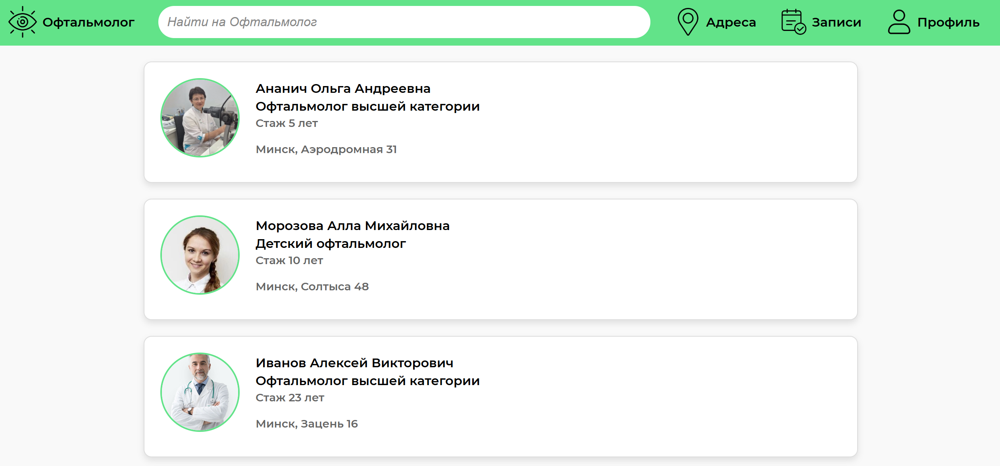
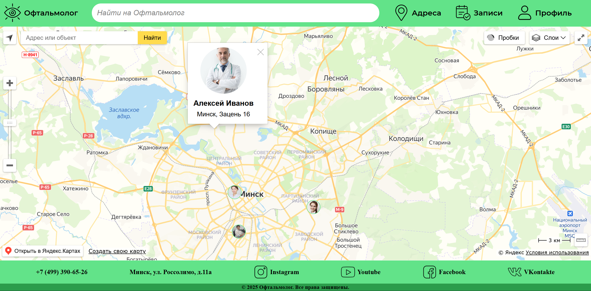
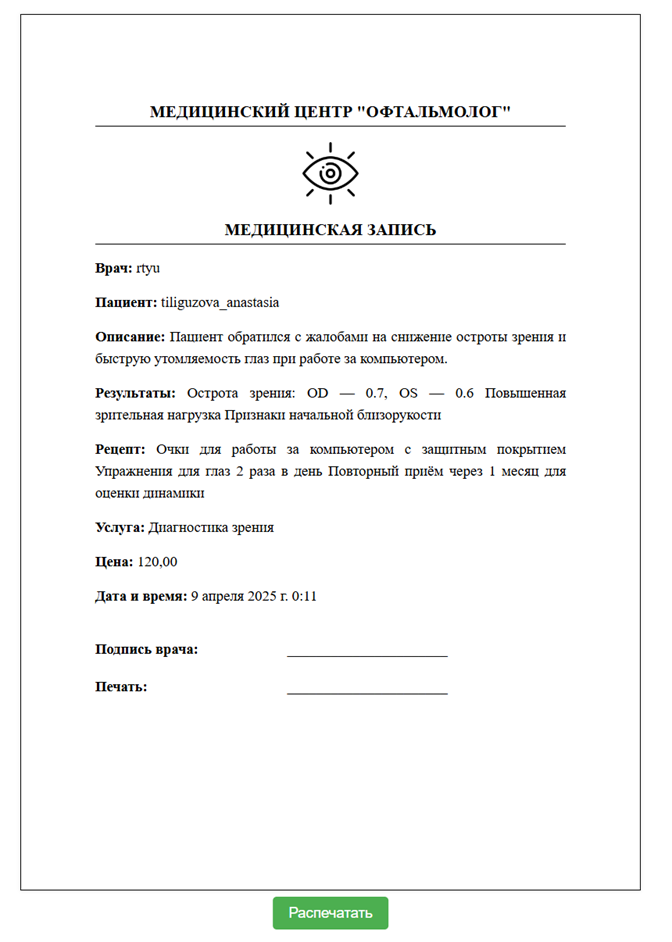
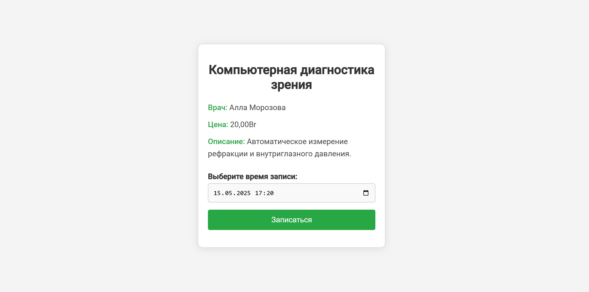
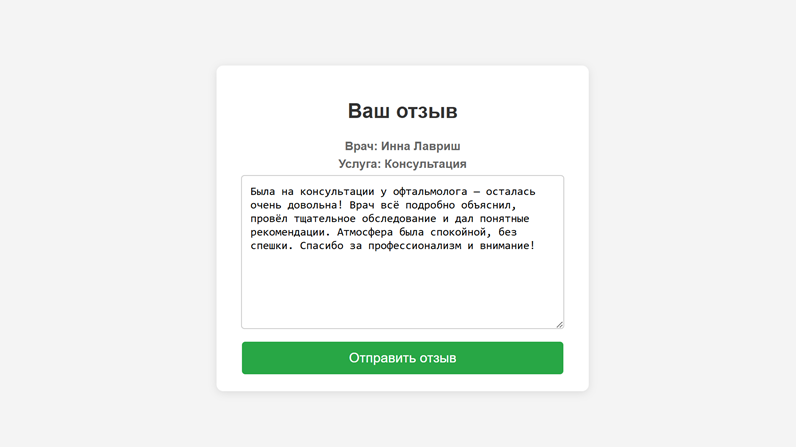
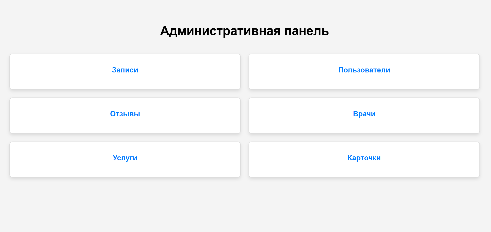
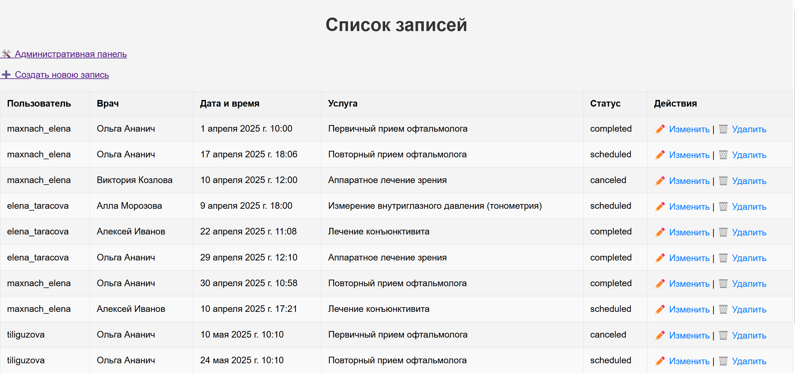

# ophthalmologist

**Цель**: разработка веб-приложения для медицинского центра, специализирующегося на офтальмологии. Приложение предоставляет функционал для удобного взаимодействия с пациентами, врачами и администраторами. Пациенты могут записываться на прием, получать результаты обследований и рецептов, оставлять отзывы. Врачи могут заполнять данные обследований и рецептов, а администраторы управляют всей системой и следят за расписанием врачей.

## Основные функциональные возможности

### Для незарегистрированных пользователей:
- Просмотр услуг.
- Просмотр списка врачей.
- Просмотр адресов с картой.

### Для зарегистрированных пользователей:
- Ведение личного кабинета.
- Запись и отмена записей к врачу, выбор даты и времени.
- Просмотр истории приемов.
- Просмотр и печать результатов обследований и рецептов.
- Получение результатов на электронную почту.
- Написание отзывов о приеме.

### Для пользователей-специалистов:
- Ведение личного кабинета.
- Заполнение данных обследований и рецептов.
- Просмотр и корректировка записей на прием.
- Просмотр отзывов о себе.
- Создание онлайн-консультаций.

### Для администраторов:
- Управление базой данных.
- Модерация отзывов.

## Скриншоты

### Главная страница

### Карта 

### Документ о приеме

### Запись на прием

### Написание отзыва

### Панель администратора

### Панель администратора записи

